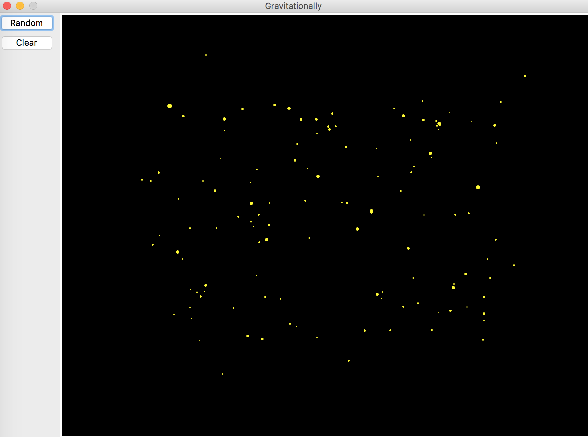
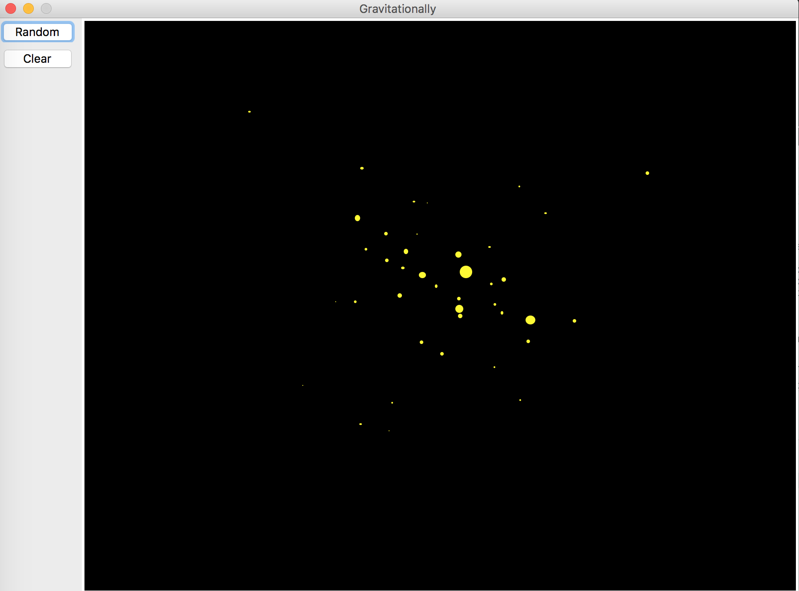
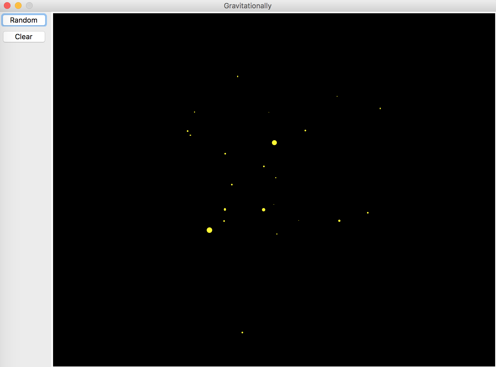

# Gravitationally

A beautiful, simple gravitational N-body simulation implemented in Python.

## Screenshots

## Use

The application requires Python2 installed. 

1. To execute simply type the following in the terminal / run box:

    python Gravitationally.py

2. Select "Random" on the left pannel

For more information 
* 